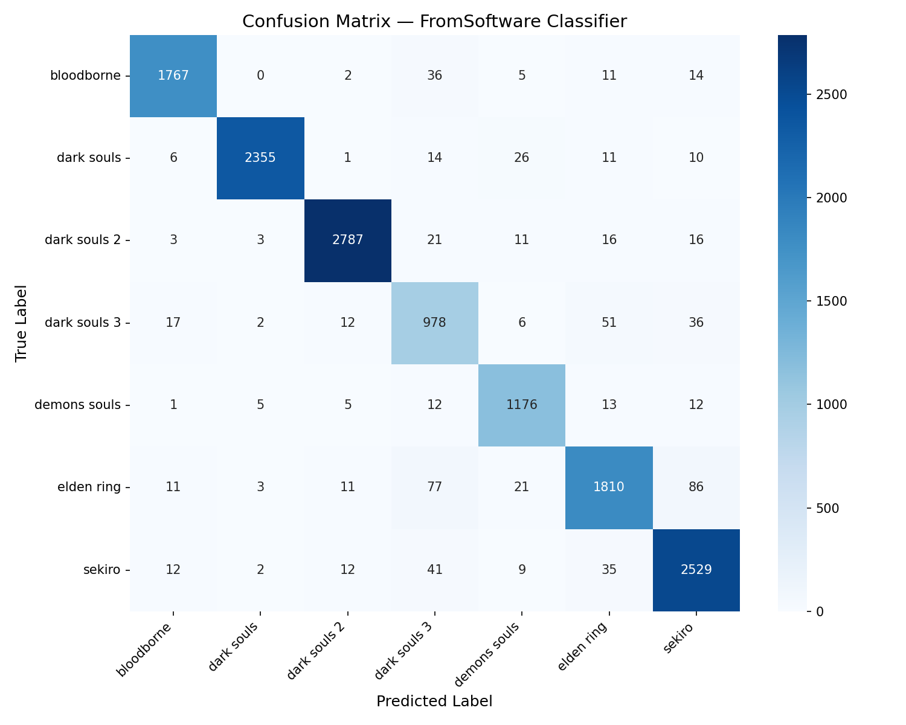

# 🗡️ FromSoftware Game Screenshot Classifier

A full-stack deep learning web application that classifies uploaded screenshots into the correct game from the FromSoftware catalog. Built with a decoupled architecture, the application features a PyTorch machine learning backend and a responsive React frontend styled with a dark-fantasy aesthetic.


## 🏗️ Technology Stack

### Machine Learning & Data
* **PyTorch & Torchvision:** Model training, transfer learning, and image transformations.
* **Scikit-Learn:** Metrics evaluation (classification reports, class weight calculation).
* **Seaborn & Matplotlib:** Confusion matrix visualization.

### Backend (API)
* **FastAPI:** Asynchronous API routing and structured error handling.
* **Redis:** In-memory caching for redundant inference requests.
* **SlowAPI:** IP-based rate limiting to protect the model endpoint.
* **Python-Multipart:** Spooled handling of large image payloads.

### Frontend (UI)
* **React (Vite):** Fast, component-based Single Page Application.
* **Tailwind CSS:** Custom styling configured with a Bloodborne-inspired color palette.
* **Axios:** API client with custom error interception.

### Deployment & DevOps
* **Docker:** Containerization for the PyTorch API.
* **Hugging Face Spaces:** Cloud hosting for the backend (16GB RAM tier).
* **Vercel:** Edge network hosting for the React frontend.

---

## 📊 The Dataset

The model was trained on the [Images from FromSoftware Soulslikes](https://www.kaggle.com/datasets/fraxle/images-from-fromsoftware-soulslikes) dataset (Apache 2.0). 

* **Total Images:** ~139,000 
* **Classes (7):** *Bloodborne, Dark Souls, Dark Souls 2, Dark Souls 3, Demon's Souls, Elden Ring, Sekiro: Shadows Die Twice*.
* **Data Pipeline:** The raw dataset was programmatically filtered and split into a rigorous **80% Training (112,748 images) / 10% Validation / 10% Test (14,100 images)** stratified split.

---

## 🧠 Model Architecture & Optimization

The classifier uses a **ResNet50** backbone, leveraging transfer learning to accurately extract features from complex, visually similar fantasy environments.

Several optimization techniques were implemented to ensure high accuracy and prevent overfitting:
* **Dynamic Class Weighting:** The dataset featured severe class imbalance (e.g., 26k images for *Sekiro* vs. 11k for *Dark Souls 3*). Inverse frequency class weights were calculated and passed to the `CrossEntropyLoss` function, heavily penalizing the model for ignoring minority classes.
* **Data Augmentation:** The training pipeline utilized `RandomCrop`, `RandomHorizontalFlip`, and `ColorJitter` to artificially expand the dataset and prevent the network from memorizing sequential frames.
* **Layer Freezing:** Base convolutional layers were frozen during early epochs to preserve ImageNet feature extraction, while the custom 7-node classification head was trained using the `AdamW` optimizer.

---

## 📈 Performance & Evaluation

The model achieved an outstanding **0.95 weighted F1-score** across 14,100 unseen test images, proving its ability to generalize rather than memorize.

### The Confusion Matrix


**Key Insights:**
1. **Legacy Isolation:** The model operates flawlessly on older titles. *Bloodborne* (0.97 F1) and *Dark Souls 2* (0.98 F1) are rarely confused with modern titles due to their distinct gothic/desaturated architectural styles.
2. **The "Engine Bleed":** As expected, the highest rate of confusion exists between *Dark Souls 3* and *Elden Ring*. Because they share the same proprietary game engine and highly similar asset texturing (lighting models, stone walls), the network occasionally struggles to separate them.
3. **Color Palette Reliance:** The matrix revealed 86 *Elden Ring* images misclassified as *Sekiro*. This highlights the model's reliance on vibrant color palettes (bright greens/yellows) and outdoor foliage, which are prominent in both games but absent from the rest of the catalog.

---

## 🛡️ Backend Optimization & Safety

Serving a ~100MB PyTorch model in production is computationally expensive. The FastAPI backend implements strict guardrails:
* **Pre-Inference Validation:** Files are validated for MIME type (JPEG/PNG) and size limits (< 5MB) *before* touching the PyTorch tensor transforms, dropping bad requests instantly.
* **Redis Caching:** Valid images are hashed via SHA-256. If a user uploads the exact same screenshot twice, the API bypasses the neural network entirely and returns the cached prediction in milliseconds.
* **Fail-Open Architecture:** If the Redis instance disconnects, the API gracefully catches the exception and routes the image to the model anyway, preventing a total application crash.
* **Rate Limiting:** Global limits (e.g., 10 requests/minute per IP) prevent malicious actors from spamming the endpoint and causing an Out-of-Memory (OOM) error.

---

## 💻 Local Setup

If you wish to run the decoupled application locally:

**1. Start the API (Terminal 1)**
```bash
cd backend
python -m venv venv
source venv/bin/activate  # Windows: venv\Scripts\activate
pip install -r requirements.txt
uvicorn main:app --reload
